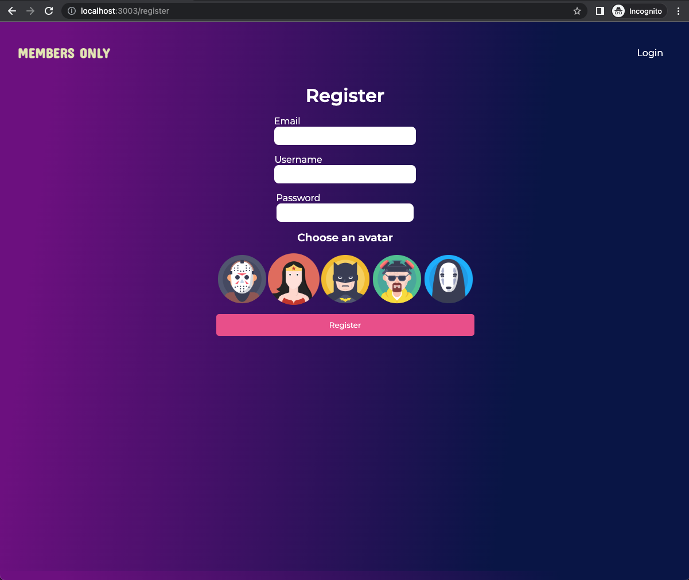

# MEMBERS ONLY

An exclusive clubhouse where members can write anonymous posts. Inside the clubhouse, members can see who the author of a post is and when it was posted, but outside they can only see the story and wonder who wrote it.

Live 👉

### Functionality :

Members can :

- View all posts,
- Create , edit and delete their own post,
- See the Author and the Date of others posts

Non members can:

- Only see anonymos posts

Admin can:

- See all posts details (author , date...)
- Create , edit and delete their own post,
- Create , edit and delete all posts,

### Tech stack

- Node.js and Express to build the backend server
- EJS for the Template engine
- MangoDb for the database
- Mongoose as modeling tool for MongoDB

### Homepage non-members

### Homepage for members

### Members dashboard

### Admin's Homepage

### Registration page

